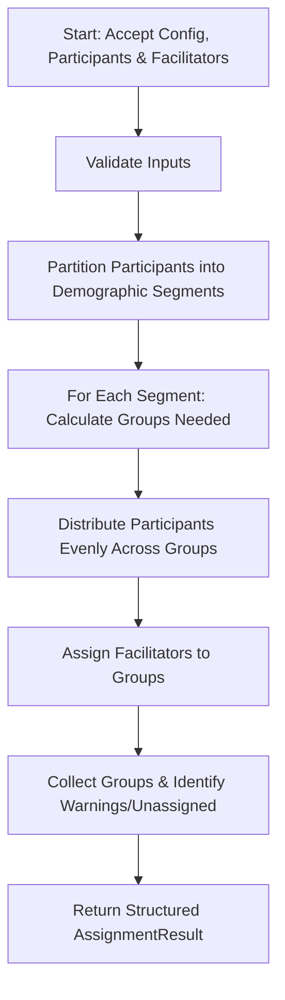

# Divided Session Manager (Small Group Session Manager)

The **Divided Session Manager** is a backend core engine designed to automate the assignment of event participants into small groups with appropriate facilitators during church events. 

This system originates from a real operational pain point observed in church event management. During events, the registration committee is responsible for manually registering walk-in participants and assigning them to small discussion groups in real time. As participant count grows, this task becomes error-prone, inconsistent, and highly stressful for volunteers. The Divided Session Manager automates these grouping decisions by encoding complex business rules into a fast, stateless algorithm.

---

## 🚀 Key Features

*   **Configurable Grouping Rules**: Handles gender modes (separated vs. mixed), target group sizes, and hard group caps.
*   **Automatic Demographic Segregations**: Automatically categorizes participants by derived Age Tiers (Teens, Youth, Young Adults) and Life Stages (Students, Working Professionals).
*   **Facilitator Allocation**: Automatically assigns one required Leader and an optional Assistant to each group, prioritizing same-gender facilitators in gender-separated events.
*   **Robust Edge-case Handling**: Gracefully handles insufficient facilitators (consolidating groups within caps), unregistered walk-ins, and out-of-bounds demographics, returning detailed warnings rather than failing.

---

## 📋 System Requirements & Rules

### 1. Domain Entities & Attributes

*   **Participant**: An attendee registered for the event. Counted toward the group size.
    *   *Attributes*: Name, Age, Gender, and derived Age Tier (and Life Stage if Young Adult).
*   **Facilitator**: A volunteer leader. Not counted toward group size.
    *   *Attributes*: Name, Role (`LEADER` or `ASSISTANT`), Gender, and Qualified Age Tiers.
*   **Group**: A set of participants plus their assigned facilitator(s).
*   **SessionConfig**: Event-level settings governing the grouping rules (gender mode, target size, cap, enabled tiers, and life-stage toggles).

### 2. Demographic Definitions
*   **Age Tiers**:
    *   **TEENS**: Age 13–15
    *   **YOUTH**: Age 16–22
    *   **YOUNG_ADULT**: Age 23+
    *   *Note: Gaps or ages below 13 are treated as out-of-bounds and return an empty `Optional<AgeTier>` from the lookup.*
*   **Life Stages (within YOUNG_ADULT)**: `STUDENT` or `WORKING_PROFESSIONAL` (optional subgrouping).
*   **Gender**: `MALE` or `FEMALE` (for simplicity in grouping).
*   **Gender Modes**: `SEPARATED` or `MIXED`.

---

## 🧩 Grouping Constraints (Priority Order)

When partitioning and distributing participants into groups, the algorithm enforces constraints in the following order of priority. A higher-priority constraint is **never** violated to satisfy a lower-priority one:

| Priority | Constraint | Description / Rule |
| :--- | :--- | :--- |
| **1** | **Hard Cap** | Groups must *never* exceed the configured maximum cap size under any circumstance. |
| **2** | **Gender Separation** | In `SEPARATED` mode, male and female participants must be placed in separate groups. |
| **3** | **Age Tier Separation** | Teens, Youth, and Young Adults must always be placed in separate groups. |
| **4** | **Life Stage Separation** | If YA sub-grouping is enabled, Students and Working Professionals must be separated. |
| **5** | **Target Size** | The algorithm aims to hit the target size (default: 4) before opening a new group, deviating only to satisfy priorities 1–4. |
| **6** | **Facilitator Coverage** | Each group must have exactly one `LEADER`. Assistant assignment is optional. |

---

## ⚙️ Algorithm Flow



1.  **Input Validation**: `SessionConfig` is instantiated via `SessionConfig.create(...)` which explicitly validates all fields and rejects missing caps, zero/negative targets, or configurations where `targetSize > capSize`.
2.  **Segmentation**: Partition the input participant list into distinct segments based on `(Gender if SEPARATED) × (Age Tier) × (Life Stage if enabled)`. Participants with ages outside the active tiers (returning `Optional.empty()` for `AgeTier`) are automatically excluded from grouping and placed in the unassigned list.
3.  **Group Division**: For each segment, calculate the optimal number of groups: `Groups = ceil(segment.size / targetSize)`. Ensure `Groups × cap >= segment.size`. Tie-breaks or splits are processed with **YOUTH** segments handled first.
4.  **Consolidation**: If the total number of groups exceeds available leaders, groups are consolidated up to the `capSize` limit to conserve facilitators. If groups still exceed available leaders, they are left leaderless (leader set to `null`) and marked with a warning so the organizer can add a new facilitator.
5.  **Distribution**: Distribute participants in each segment as evenly as possible across the final groups.
6.  **Facilitator Assignment**:
    *   Assign one qualified `LEADER` to each group.
    *   If available, assign one `ASSISTANT`.
    *   In `SEPARATED` mode, prefer matching the facilitator's gender to the group's gender.
7.  **Warnings & Results**: Collect unassigned participants (with a free-form reason string such as `"Age under 13"` or `"Age outside active tiers"`) or groups lacking facilitators into the `AssignmentResult` metadata.

---

## 🏛️ Technical Architecture & Modules

The project is structured as a multi-module Maven project built with **Java 17+**:

```
divided-session-manager/
├── pom.xml                        # Parent Maven POM
├── session-manager-core/          # Pure Java algorithm library (no external frameworks)
│   ├── pom.xml
│   └── src/
│       ├── main/java/org/c3cavite/core/
│       │   ├── domain/            # Domain model classes (Gender, AgeTier, SessionConfig, etc.)
│       │   └── service/           # Core Algorithm Service & Segmentation Logic
│       └── test/java/org/c3cavite/core/
│           └── domain/            # JUnit 5 Unit Tests
└── session-manager-service/       # Spring Boot web service wrapper
    ├── pom.xml
    └── src/                       # Exposes REST API (POST /api/v1/sessions/assign)
```

---

## 🗺️ Project Roadmap

### Phase 1: Core Engine & Microservice (Current)
*   **Phase 1A (Core Library)**: Core domain POJOs (`Participant`, `Facilitator`, `Group`, `SessionConfig`), `GroupAssignmentService` implementation, and standard JUnit 5 test suite covering happy paths and edge cases.
*   **Phase 1B (Microservice)**: Spring Boot web wrapper, `POST /api/v1/sessions/assign` JSON endpoint, Dockerfile configuration, and `docker-compose.yml` for local development.

### Phase 2: Web Platform & Persistence (Planned)
*   **Phase 2A (Web Backend)**: PostgreSQL database schema, event/participant CRUD endpoints, and Spring Data JPA integration.
*   **Phase 2B (Web Frontend)**: React-based registration and facilitator coordination UI, real-time group assignment displays, and printable group rosters.

---

## 🛠️ Development & Getting Started

### Prerequisites
*   Java Development Kit (JDK) 17 or higher
*   Apache Maven 3.6+

### Compile and Build
To compile the project and build the JAR artifacts, run:
```bash
mvn clean package
```

### Run Unit Tests
To execute the JUnit 5 test suites:
```bash
mvn test
```
